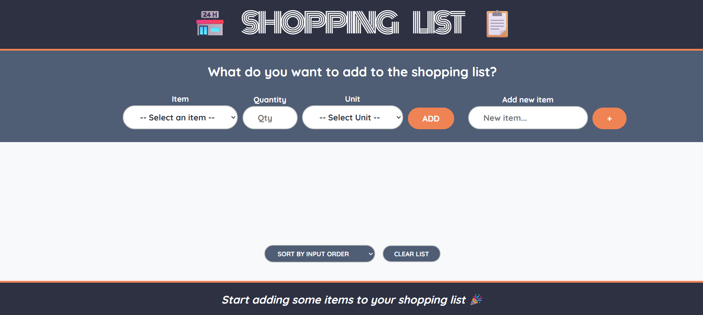
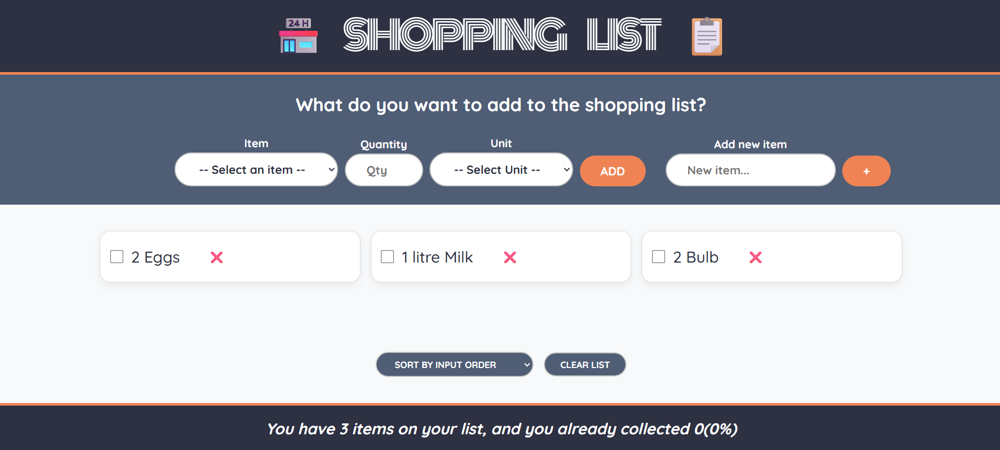
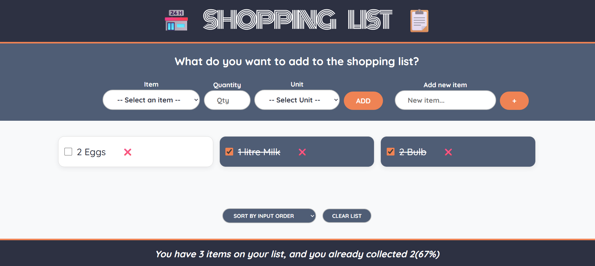
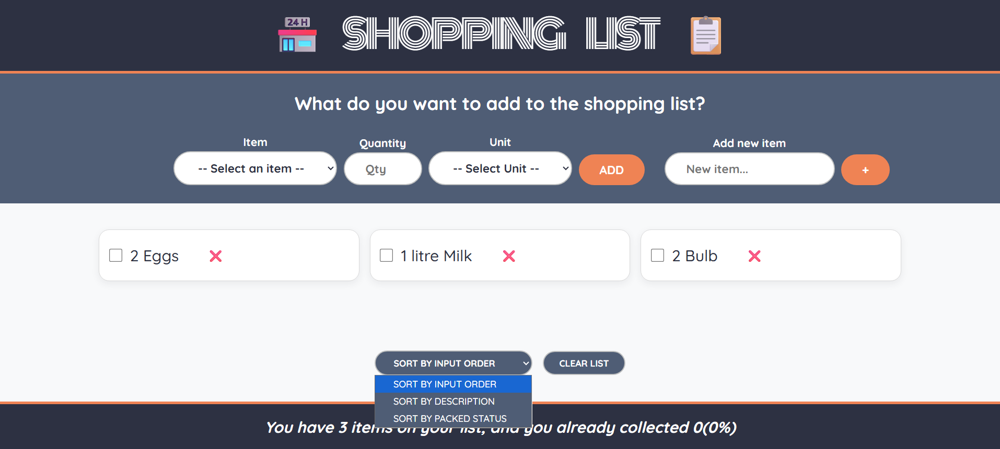
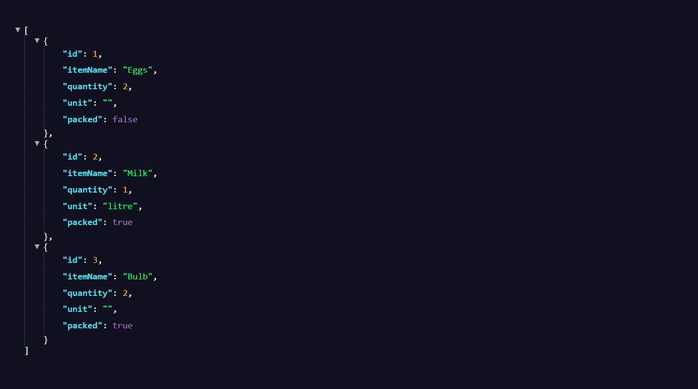

# 🛒 Shopping List – Full Stack Web Application

A full-stack Shopping List web application built using **React (Frontend)** and **Spring Boot (Backend)**.  
The app allows users to add, manage, sort, and track shopping items with real-time persistence.

🔗 **Live Website:**  
https://shopping-list-siddhant.netlify.app

🔗 **Backend API:**  
https://shopping-list-nsjd.onrender.com/api/items

---

## 🚀 Features

- Add shopping items with quantity and unit
- Mark items as packed/unpacked (persistent)
- Sort items by:
  - Input order
  - Description
  - Packed status
- Clear entire shopping list
- Responsive design (mobile + desktop)
- Backend REST API with database persistence
- Deployed frontend & backend

---

## 📸 Screenshots

### 🏠 Home Page



### ➕ Add Items



### 📋 Packed Items



### 🔀 Sorting Items



### 📱 Backend Api



---

## 🧑‍💻 Tech Stack

### Frontend

- React (Hooks)
- Axios
- CSS (Responsive UI)
- Netlify (Deployment)

### Backend

- Java
- Spring Boot
- Spring Data JPA
- H2 Database (can be replaced with MySQL)
- Docker
- Render (Deployment)

---

## ⚙️ Running the Project Locally

### Backend (Spring Boot)

```bash
cd backend
./mvnw spring-boot:run
```

API runs on:
https://shopping-list-nsjd.onrender.com/api/items

```bash
cd frontend
npm install
npm start
```

App runs on:
http://localhost:3000
or check
https://shopping-list-siddhant.netlify.app
